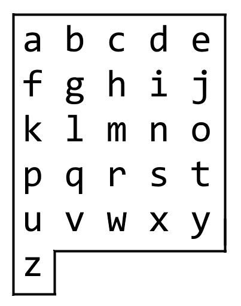

# leetCodeSolution
#### Writing sample for a LeetCode Medium Solution 

## 1138. Alphabet Board Path
#### Medium

<p align="center">

</p>

As the title suggests we should think of the alphabet as a board. We use the
string target as a reference for the letters we need to find in the list board. 

### <ins>Goal:</ins> 

```
board = [ 'abcde', 'fghij', 'klmno', 'pqrst', 'uvwxy', 'z' ]
target = 'leet'
```
Target acts as a reference for the letters we must find on the alphabet board. Each time we start at 'a' and begin our search. Our goal is to find every letter from target on the board. 
As we find each letter we must track the directions we take along the way, 
e.g., Down, Down, Left, Right, etc.  

<ins>Example 1:</ins> 
Here's an example of what is expected of us. 
```
Input: target = "leet"
Output: "DDR!UURRR!!DDD!"
```

<br> 

## <ins>Brute Force Solution</ins>

As the data is currently formatted, we would need to continually loop through
the board list. So for every letter in target we need to loop one time. 

This approach is possible but we also need to keep the worst case scenario in
mind. If we must loop over board to find each letter, what if target is a
string that contains only 'z' and target length is 100?
This would create a huge bottleneck in our code because we could potentially
have to loop over the board alphabet 100 times. 

### ** Insert Time Complexity HERE ** 

<br>

## <ins>Better Solution</ins>
The bottle neck in the previous example appeared because we tried to access the
letters using the board *list*. We need to find an alternative data structure
that allows us to:
- Access letter quickly 
- Access each letter's position in relation to other letters

Re-imagine the alphabet board so that every letter contains coordinates, as
shown in the image below. 

<p align="center">

</p>

A dictionary allows us to organize our alphabet board in a way that meets our
data structure requirements. The lookup time for a dictionary is O( 1 ) and we
can pair our letters with their coordinates on the board, e.g., 'a': (0,0),
'b': (0,1), etc.
Let's create a dictionary comprehension to create our new board dictionary. 

```
new_board = { board[word][letter]: (word,letter) for word in range(len(board))
                                             for letter in range(len(board[word])) }
```

### *How do we use our dictionary to solve this problem?*

Here's a quick example for how we will use our dictionary. If target = 'aj' our
task is to record the directions we need to take from 'a' in order to arrive at 'j'.
Remember that our dictionary key-value pair is letter: ( row, column ).

```
Start at 'a': (0,0) 
End at 'j': (1,4) 

verticalMovement = destinationRow - currentRow = 1 - 0 = 1 
horizontalMovement = destinationCol - currentCol = 4 - 0 = 4

Since we always start at (0,0) assume that any positive vertical movement is
down, and any positive horizontal movement is to the right. 

Therefore our vertical movement is 1 down, i.e., 'D' and
our horizontal movement is 4 right, i.e., 'RRRR'.

Output:'DRRRR!'
```
In the example we developed a formula for finding directions between letters. 
Now let's convert that into some code. We want to calculate the difference
between  

```
def calculate( curr, dest ):
   currRow, currCol = curr # We can unpack our tuples this way
   destRow, destCol = dest 

   row = destRow - currRow
   col = destCol - currCol 

   return row, col 
```


