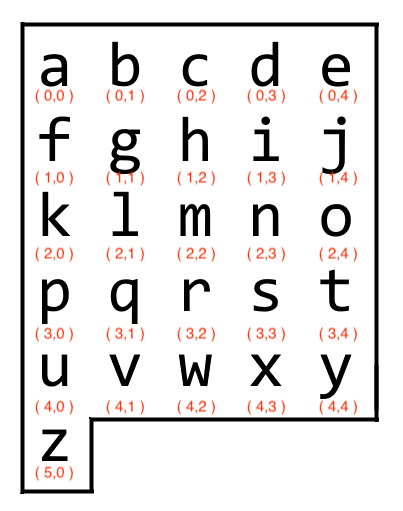

# leetCodeSolution
#### Writing sample for a LeetCode Medium Solution 

## 1138. Alphabet Board Path
#### Medium https://leetcode.com/problems/alphabet-board-path/

<p align="center">

  figure 1
</p>

### <ins>Goal:</ins> 
We are given the following parameters, board and target. Our board variable will always remain the same, while target will be any series of lowercase letters.

```
board = [ 'abcde', 'fghij', 'klmno', 'pqrst', 'uvwxy', 'z' ]
target = 'leet'
```
Target acts as a reference for the letters we must find on the alphabet board. The starting point is always 'a' on your board. Our goal is to find every letter from target on the board. 
As we find each letter we must record the directions we take along the way, 
e.g., Down, Down, Left, Right, etc.  

<ins>Example 1:</ins> 
Here's an example of what inputs and outputs are expected from us. 
```
Input: target = "leet"
Output: "DDR!UURRR!!DDD!"
```
The exclamation points act as a separator between each letter in target.
Once we find a letter, we also add an exclamation point. 

<br> 

## <ins>Initial Strategy: Approaching Our Solution</ins>
```
board = [ 'abcde', 'fghij', 'klmno', 'pqrst', 'uvwxy', 'z' ]
target = 'leet'
```

One way to approach a solution is to talk through a solution without using any
code. If we can articulate a solution, then we can convert the solution into
code. 

Fig. 1, depicts our board variable as an actual board. Starting from 'a', we 
can navigate up, down, left, or right to find each letter in target. 


As the data is currently formatted, we could find our solution. We would need
to loop through the board list to find every letter in target. 
It's important to remember that our solution needs to be optimal for even the
worst case scenario. If target is a string of 100 z's then our algorithm would
need to loop from a to z every
As the data is currently formatted, we would need to continually loop through
the board list to find every letter in target. O( n^n ), where n = the length
of board. We also need to factor in the length of target. Ultimately our time
complexity would be O( n^n * t ), where t is the length of target.  

It's easy to see that this approach will not work. The length constraints for
target are target.length <= 100. Therefore our worst case scenario is: 
```
len( target ) == 100, target ='zzzzzzzzzzzzzzzzzzzzzzzzzzzzzzzzzzzzzzzzzzzzzzzzzzzzzzzzzzzzzzzzzzzzzzzzzzzzzzzzzzzzzzzzzzzzzzzzzzzz'
```
Meaning our code would need to loop through the board list 100 times to find
the position of 'z'. This creates a bottleneck for our code. We need to find a
better alternative data structure to maintain our board. 

<br>

## <ins>Better Data Structure</ins>
We need to find an alternative data structure that allows us to:
- Access letters quickly 
- Access each letter's position in relation to other letters

One way to do this is to re-imagine the alphabet board so that every letter contains coordinates, as
shown in the image below. This way each letter is paired with a set of
coordinates. 

<p align="center">

</p>

This approach allows us to use a dictionary. A dictionary pairs together a
key : value combination. The key allows us to lookup the value in O( 1 ) time. 

In our case, our key : value combination could be letter : ( row, column ),
e.g., 'a': (0, 0), 'b': (0, 1), 'c': (0, 2), etc. 

Let's create a dictionary comprehension to create our new_board dictionary. 

```
new_board = { board[word][letter]: (word,letter) for word in range(len(board))
                                             for letter in range(len(board[word])) }
```

### *How do we use our dictionary to solve this problem?*

Here's a quick example of how we will use our dictionary. 

target = 'aj'

Our task is to record the directions to get from 'a' to 'j'. 

```
Current position at 'a': (0,0) 
Destination position at 'j': (1,4) 

verticalMovement = destinationRow - currentRow = 1 - 0 = 1 
horizontalMovement = destinationCol - currentCol = 4 - 0 = 4

Since we always start at (0,0) assume that any positive vertical movement is
down, and any positive horizontal movement is to the right. 

Therefore our vertical movement is 1 down, i.e., 'D' and
our horizontal movement is 4 right, i.e., 'RRRR'.

Output:'DRRRR!'
```

Now that we have developed a way to deal with the coordinates in our
dictionary, we can now write the code for it. 

```
def calculate( curr, dest ):
   currRow, currCol = curr # We can unpack our tuples this way
   destRow, destCol = dest 

   verticalMovement = destRow - currRow
   horizontalMovement = destCol - currCol 

   return row, col 
```
## <ins>Code</ins>
```
class Solution:
   def alphabetBoardPath( self, target: str ) -> str:

      board = [ 'abcde', 'fghij', 'klmno', 'pqrst', 'uvwxy', 'z' ]

      new_board = { board[word][letter]: (word,letter) for word in range(len(board))
                                                   for letter in range(len(board[word])) }
      
      def calculate( curr: tuple, dest: tuple ) -> tuple:

         currRow, currCol = curr # We can unpack our tuples this way
         destRow, destCol = dest 

         verticalMovement = destRow - currRow
         horizontalMovement = destCol - currCol 

         return row, col # return a tuple 
     
     curr = (0,0) # our default starting point
     ans = '' # return this 

     for i in range( len( target ) ):

        row, col = calculate( curr, new_board[ target[ i ] ])

        if row == 0 and y == 0: # 0,0 means same letter again, e.g., 'ee' 
           ans += '!'
           continue
        
        # Adjust Left, Up
        if col < 0: 
           while col < 0:
              ans += 'L'
              col += 1
        if row < 0:
           while row < 0:
              ans += 'U'
              row += 1

        # Adjust Right, Down
        if col > 0:
           while col > 0:
              ans += 'R'
              col -= 1

        if row > 0:
           while row > 0:
              ans += 'D'
              row -= 1 

        curr = new_board[ target[ i ] ]
     ans += '!'
      

     return ans 
```

### <ins>Complexity Analysis:</ins> 
- Time Complexity: *O( N )* where *N* is the number of letters inside target. 
- Space Complexity: *O( N )* where *N* is the number of entries in our
  dictionary  
